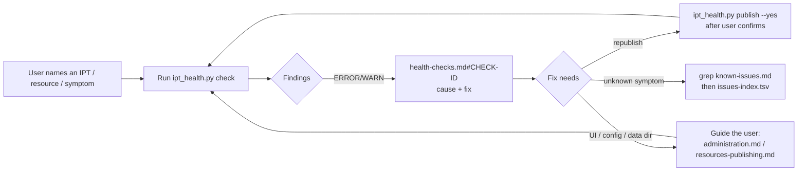

# Integrated Publishing Toolkit (IPT)

The [IPT](https://www.gbif.org/ipt) is GBIF's Java web application (Struts 7 +
FreeMarker, no database — all state is files in a **data directory**) that turns
source data (files, URLs, SQL databases) into Darwin Core Archives or data
packages plus EML metadata, versions them, and registers them with the GBIF
Registry so GBIF can crawl them. One installation = one **IPT instance**; one
dataset = one **resource**, addressed everywhere by its **shortname** (`r=`).

This skill is a synthesis of the gbif/ipt source code (main, 3.3.7-SNAPSHOT,
commit `62097149`), the [IPT manual](https://ipt.gbif.org/manual/en/ipt/latest/),
all 2608 GitHub issues (to 2026-10-02), and endpoint behaviour observed on live
IPT 3.3.4/3.3.6 instances. Facts deduced but not observed are tagged `[INFERENCE]`
inside the references.

---

## Workflow: check → report → fix



1. **Check.** Run the script first; do not hand-probe endpoints when a check exists.
   ```bash
   python scripts/ipt_health.py check https://ipt.example.org/ipt            # public + GBIF cross-checks
   python scripts/ipt_health.py check https://ipt.example.org/ipt --resource myshortname
   IPT_USER=<email> IPT_PASSWORD=<password> python scripts/ipt_health.py check https://ipt.example.org/ipt
   ```
   Credentials come **only** from env vars `IPT_URL`, `IPT_USER`, `IPT_PASSWORD`;
   never put them on the command line, in files, or in your answer. Without
   credentials the report covers public resources only (`AUTH-SKIPPED`).
   Large instances take minutes (≈500 resources ≈ 3–4 min); use `--no-gbif`
   or `--resource` to narrow, `--json` for machine output.
2. **Report.** The script prints a Markdown table: severity (ERROR/WARN/INFO),
   stable check ID, resource, message, evidence URL, fix pointer. Exit code 1
   if any ERROR. Present ERRORs first, group by resource, and translate each
   finding into the cause and the next action from
   `references/health-checks.md#<check-id>` (lower-case anchor, e.g. `#res-overdue`).
3. **Fix.** The only automated fix is republishing:
   ```bash
   python scripts/ipt_health.py report  https://ipt.example.org/ipt --resource myshortname   # read the failure first
   python scripts/ipt_health.py publish https://ipt.example.org/ipt --resource myshortname --yes
   ```
   Publishing creates a new public version (and may update a DOI and the GBIF
   registration). **Ask the user before running `publish`**, and only after
   reading the last report — republishing a resource whose source is broken just
   produces another failure. Everything else (metadata, mappings, source
   connection, auto-publication settings, registration, upgrades, disk,
   proxy/base URL) is fixed by the user in the IPT UI or on the server: give
   the exact UI path or file from the references, then re-run `check`.

### Symptom → where to look
| Symptom | Start with |
|---|---|
| "Dataset not updating on GBIF" | `check --resource` → `GBIF-*` findings; `health-checks.md` §8.1 |
| Publication fails | `report --resource`, then `known-issues.md` §4–7 by the exact log line |
| Auto-publication not running / next publication overdue | `RES-OVERDUE`; `resources-publishing.md` → Auto-publication; `health-checks.md` §8.3 |
| Publish button disabled / greyed | `RES-BLOCKED`; `resources-publishing.md` → "Why is the publish button blocked?" |
| Instance down, 500s, login loops | `IPT-*` findings; `health-checks.md` §8.4; `known-issues.md` §1–2 |
| Upgrade / Java / Tomcat / Docker question | `releases.md`, `administration.md` §2, §14 |
| Any log or error message | grep `known-issues.md` (cheat sheet "Log message → meaning"), then `issues-index.tsv` |
| "Which URL does X?" | `endpoints.md` |

---

## Facts an agent must get right

- **HTTP GET can mutate.** IPT actions test a flag parameter, not the HTTP method:
  `GET /manage/resource-deleteFromIpt.do?...&deleteFlag=…` deletes, `GET
  /admin/publishAll.do` publishes everything, `GET /manage/cancel.do?r=` cancels a
  running publication (even anonymously on 3.3.6). Never call an endpoint marked
  ⚠️ in `endpoints.md` during a check, and never follow links blindly.
- **Login** (`endpoints.md` §4): GET `/login.do` → `JSESSIONID` + `CSRFtoken`
  cookies and hidden `csrfToken`; POST `email`, `password`, `csrfToken`. Success =
  302; failure = 200. The CSRF cookie is bound to the host of the configured base
  URL — call the IPT through that exact host or login fails silently.
- **Roles:** `User` < `Manager` < `Publisher` (registration/DOI rights) < `Admin`.
  `/manager-api/resources` shows only resources the account manages (Admin: all);
  `/admin/logfile.do` needs Admin.
- **`/api/resources`** (DataTables) returns 10 rows unless you send `length`;
  13 columns, col 8 = next publication (overdue wrapped in `text-gbif-danger`),
  col 11 = shortname; URL-encode `[` `]` or Tomcat answers 400.
- **`/inventory/v2/dataset`** = latest published public versions with
  `records`, `lastPublished`, `version`, `gbifKey`; it has no next-publication field.
- **Status codes lie:** a missing resource can answer 200/302 instead of 404.
  Parse the body.
- **Publication state is volatile.** `manage/report.do` is in memory (empty after
  restart); `publicationlog.do?r=` is the persistent log. While publishing,
  `manage/resource.do` redirects to `locked.do`.
- **Auto-publication stops itself after 3 consecutive failures.** The counter is in
  memory: a restart or a manual publish resets it. A "records dropped" skip counts as
  a failure; "data not changed" does not.
- **Visibility/status changes take effect only at the next publication.** Statuses:
  `PRIVATE`, `PUBLIC`, `REGISTERED` (with GBIF), `DELETED`.
- **Publish button blocked** (`publish-button-show-warning`) is not only invalid
  metadata: also no publishing organisation, missing data-package mappings, a
  registered resource without a GBIF-supported licence, no DOI account, missing
  Publisher rights, or DELETED status.
- **Test vs production:** an IPT in test mode registers against
  `gbrds.gbif-uat.org` / `api.gbif-uat.org`; the mode is fixed at setup. The script
  reads it from `/api/health` and switches GBIF API automatically.
- **Versions:** 3.3.x needs Java 17 + Tomcat 10.1/11 (Docker image is non-root);
  do not stop at 3.3.0 (resources may fail to load — fixed in 3.3.1); treat ≥ 3.3.3
  as the security floor `[INFERENCE]`. No downgrade after 2.5.6. Always back up the
  data directory before upgrading. Details: `references/releases.md`.
- **Secrets on disk:** `config/users.xml`, `config/registration2.xml` (registry
  tokens, DOI passwords) and SQL source passwords in `resource.xml`. Never print or
  copy them.

---

## Scripts

Standard library only, no installation.

| Command | Purpose | Login |
|---|---|---|
| `ipt_health.py check <url> [--resource SN] [--json] [--no-gbif] [--stale-days N] [--timeout S]` | Full health check, Markdown/JSON report, exit 1 on ERROR | optional |
| `ipt_health.py resources <url> [--json]` | Table of resources: records, last/next publication, status, GBIF key | optional |
| `ipt_health.py report <url> --resource SN` | Last publication report + tail of `publicationlog.do` | yes |
| `ipt_health.py publish <url> --resource SN --yes` | ⚠️ Publish now and poll until finished | yes |
| `ipt_health.py selftest` | Offline parser self-check | no |
| `sync_issues.py [--out PATH]` | Refresh `references/issues-index.tsv` from GitHub (set `GITHUB_TOKEN` if rate-limited) | no |

Check IDs (full catalogue with causes and fixes in `references/health-checks.md`):
- **Instance:** `IPT-REACH`, `IPT-SETUP`, `IPT-REDIRECT`, `IPT-VERSION`, `IPT-OUTDATED`, `IPT-TLS`, `IPT-BASEURL`, `IPT-MODE`, `IPT-INVENTORY`, `IPT-HEALTH-NET`, `IPT-HEALTH-DISK`, `IPT-HEALTH-PERMS`, `IPT-HEALTH-SYSTEM`
- **Resource:** `RES-NOT-FOUND`, `RES-NEVER-PUBLISHED`, `RES-ZERO-RECORDS`, `RES-STALE`, `RES-NO-GBIFKEY`, `RES-OVERDUE`, `RES-ARCHIVE`, `RES-EML`, `RES-BLOCKED`, `RES-PUBLISH-FAILED`, `RES-PUBLISHING`, `RES-NO-REPORT`
- **GBIF:** `GBIF-API`, `GBIF-DATASET-MISSING`, `GBIF-DATASET-DELETED`, `GBIF-ENDPOINT`, `GBIF-NEVER-CRAWLED`, `GBIF-CRAWL-FAILED`, `GBIF-NOT-RECRAWLED`, `GBIF-COUNT-MISMATCH`, `GBIF-INSTALLATION`, `GBIF-ORPHANS`
- **Auth/logs:** `AUTH-SKIPPED`, `AUTH-LOGIN`, `AUTH-PRIVATE`, `LOG-ERRORS`, `LOG-ACCESS`

---

## References

Read the file named in the tables above instead of answering from memory; the
traps are in the details.

| File | Content |
|---|---|
| `references/health-checks.md` | Every check ID: what, endpoint, interpretation, causes, fix; manual triage runbooks (Mermaid) |
| `references/endpoints.md` | Every IPT URL with auth level, params, response shape, ⚠️ mutating flag; machine APIs in depth; login/CSRF; GBIF registry/API endpoints; data directory layout; runbook corrections; security observations |
| `references/administration.md` | Requirements, install (WAR/Docker/RPM), data directory, setup wizard, `ipt.properties`, GBIF registration, users/roles, organisations, DataCite DOI, extensions/vocabularies, logging, backup, upgrade, HTTPS/proxy, memory |
| `references/resources-publishing.md` | Resource lifecycle: create/import, sources & JDBC drivers, mappings, EML metadata and what blocks publication, licences, visibility, publish pipeline, versioning/DOI, auto-publication, registration, delete/migrate, diagnosis cheat sheet |
| `references/releases.md` | Version history 2.x–3.3, runtime requirements per version, one-way upgrade doors, security releases, playbook for old instances, how to identify a version |
| `references/known-issues.md` | ~470 symptom → cause → fix rows from all gbif/ipt issues, by theme; log-message cheat sheet; open issues affecting operators; legacy and by-design lists. Large: **grep it**, do not read it whole |
| `references/issues-index.tsv` | All gbif/ipt issues: `number, state, created, closed, labels, title` — grep by keyword, then `gh issue view <n> --repo gbif/ipt --comments` |

When nothing in the references explains a symptom, search the index, read the
issue thread, and say the answer comes from that issue (link it). If it looks like
a new bug, offer to draft an issue for https://github.com/gbif/ipt/issues with
version, steps, and the relevant log lines (secrets removed).

---

## Related skills

**[darwin-core](../darwin-core/)** — the data model the IPT publishes. Use it for
mapping questions (which DwC term, which extension/row type), and to validate a
DwC-A downloaded from `archive.do`.
**[DataProvenance](../DataProvenance/)** — to document how a published dataset was
derived (source → IPT version → GBIF crawl).
