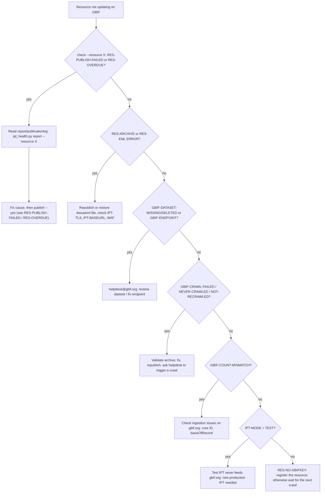
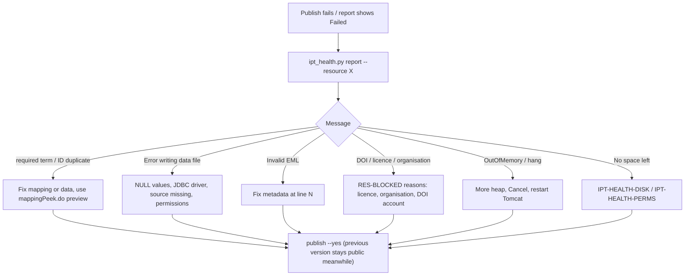
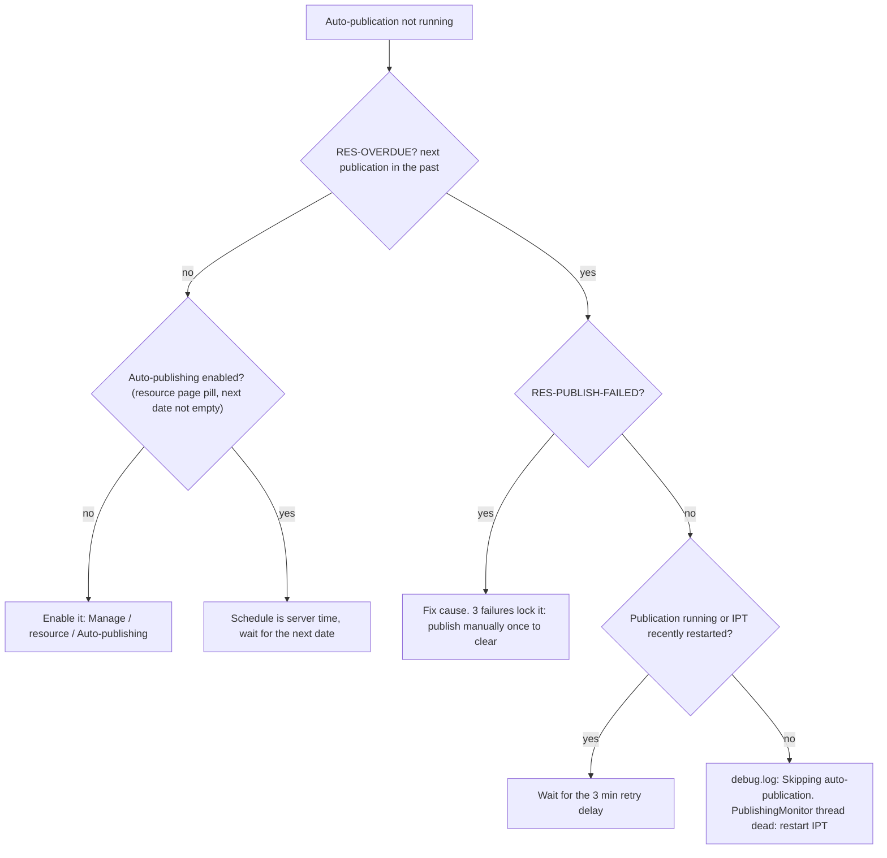
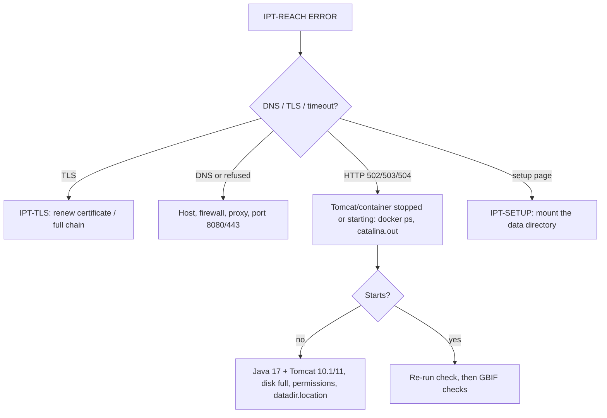

# IPT health-check catalogue

What `scripts/ipt_health.py check` tests, how to read each finding, and how to fix it. Every finding in the report carries a stable **check ID**; its section below is `## <ID>` (the script's `fix` column links here as `references/health-checks.md#<id-lowercase>`).

Related: endpoint details in `references/endpoints.md`; symptom -> cause tables in `references/known-issues.md`; UI procedures in `references/resources-publishing.md` and `references/administration.md`; version history in `references/releases.md`. Manual base URL: `https://ipt.gbif.org/manual/en/ipt/latest/<page>`.

## 1. Running the script

```bash
# public checks only (no login)
python scripts/ipt_health.py check https://ipt.example.org/ipt
# + authenticated checks (credentials ONLY via environment, never argv, never stored)
IPT_USER=manager@example.org IPT_PASSWORD='***' python scripts/ipt_health.py check https://ipt.example.org/ipt
python scripts/ipt_health.py check <url> --resource SHORTNAME --json --no-gbif --stale-days 365 --workers 4
python scripts/ipt_health.py resources <url> [--json]
python scripts/ipt_health.py report  <url> --resource SHORTNAME            # login
python scripts/ipt_health.py publish <url> --resource SHORTNAME --yes      # login; the ONLY write action
python scripts/ipt_health.py selftest                                      # offline parser self-check
```

* `IPT_URL` replaces `<base_url>`; `--timeout` (default 30 s per request), `--insecure` (self-signed IPT certificate), `--no-auth` (ignore credentials).
* Exit code `0` = no `ERROR` finding, `1` = at least one `ERROR` (or the command failed). `publish` without `--yes` refuses and exits 1.
* Severity: `ERROR` = something is broken now; `WARN` = probably wrong or about to break; `INFO` = context (the `fix` column then holds only the doc link).
* One failing check never aborts the run; a check that crashes or cannot reach the network becomes a `WARN` finding (`ERROR` for `IPT-REACH`).
* GBIF API base is derived from the IPT's registry (`/api/health` -> `networkRegistryURL`): `gbrds.gbif.org` -> `https://api.gbif.org/v1`, `gbrds.gbif-uat.org` -> `https://api.gbif-uat.org/v1` (override with `--gbif-api`). A **test-mode IPT never appears on gbif.org**; its datasets live in UAT, where counts are not guaranteed (`GBIF-COUNT-MISMATCH` is then `INFO`).
* Per-resource HTTP requests run in a thread pool (`--workers`, default 4). Authenticated per-resource requests are **sequential on purpose**: the IPT keeps the "current resource" in the shared session (`ResourceSessionInterceptor`), parallel requests would race. A 500-resource instance takes ~3 min.

### Endpoints used (all verified against source + live IPT 3.3.4/3.3.6)

| Stage | Endpoint | Login | Source |
|---|---|---|---|
| reach/version | `GET /` (footer ``) | no | `pages/inc/footer.ftl` |
| health | `GET /api/health` (JSON `status{...}`), fallback `GET /health.do` (HTML) | no | `HealthAction.java`, `struts.xml` (`ipt-api`) |
| system section | `GET /health.do` -> OS/Java/Tomcat/mode rows | yes | `pages/health.ftl` |
| inventory | `GET /inventory/v2/dataset` | no | `InventoryV2Action.java` |
| next publication | `POST /api/resources` (DataTables form; col 8 = next publication, `text-gbif-danger` span = overdue; col 11 = shortname) | no | `ResourceManagerImpl.toDatatableResourcePortalView/toUiNextPublished` |
| private + unpublished | `POST /manager-api/resources` (same 13 columns; only what the user manages, admin sees all) | yes | `struts-manage.xml`, `toDatatableResourceManageView` |
| files | `GET /archive.do?r=`, `GET /eml.do?r=` (also `metadata.do` for data packages) - only the first bytes are read | no (public resources) | `ResourceFileAction.java` |
| manage state | `GET /manage/resource.do?r=` | yes | `pages/macros/manage/publish.ftl` |
| report | `GET /manage/report.do?r=` | **no** (see 5) | `struts-manage.xml` `report` (ajaxStack) |
| log | `GET /publicationlog.do?r=` (persistent text log), `GET /admin/logfile.do?log=admin` (Admin) | public / Admin | `ResourceFileAction.publicationLog`, `LogsAction.java` |
| login | `GET /login.do` (hidden `csrfToken` + cookie `CSRFtoken`), `POST /login.do` `email,password,csrfToken` | - | `LoginAction.java`, `CsrfLoginInterceptor.java` |
| publish | `POST /manage/publish.do?r=<id>` body `publish=Publish&summary=...` | yes | `OverviewAction.publish()`, `publish.ftl` |
| GBIF | `/v1/dataset/<key>`, `/v1/dataset/<key>/process`, `/v1/occurrence/search?datasetKey=<key>&limit=0`, `/v1/installation/<key>[/dataset]` | no | live API |

## 2. Check summary

| ID | Sev | Login | One line |
|---|---|---|---|
| [IPT-REACH](#ipt-reach) | ERROR/WARN/INFO | no | instance answers, looks like an IPT, response time |
| [IPT-SETUP](#ipt-setup) | ERROR | no | redirected to setup wizard |
| [IPT-REDIRECT](#ipt-redirect) | INFO | no | base URL redirects (http->https, host) |
| [IPT-VERSION](#ipt-version) | INFO | no | version from footer |
| [IPT-OUTDATED](#ipt-outdated) | WARN/INFO | no | older than latest GitHub release |
| [IPT-TLS](#ipt-tls) | ERROR/WARN/INFO | no | certificate validity/expiry |
| [IPT-BASEURL](#ipt-baseurl) | WARN | no | inventory advertises a different host |
| [IPT-MODE](#ipt-mode) | WARN/INFO | no | test (UAT) vs production registry |
| [IPT-INVENTORY](#ipt-inventory) | ERROR/WARN/INFO | no | inventory/DataTables parse + count |
| [IPT-HEALTH-NET](#ipt-health-net) | WARN | no | registry / rs.gbif.org / public access failing |
| [IPT-HEALTH-DISK](#ipt-health-disk) | ERROR/WARN/INFO | no | data-dir disk usage |
| [IPT-HEALTH-PERMS](#ipt-health-perms) | ERROR | no | data-dir read/write problems |
| [IPT-HEALTH-SYSTEM](#ipt-health-system) | INFO | yes | OS/Java/Tomcat/mode |
| [RES-NOT-FOUND](#res-not-found) | ERROR | no | `--resource` not in inventory |
| [RES-NEVER-PUBLISHED](#res-never-published) | WARN | yes | managed resource never published |
| [RES-ZERO-RECORDS](#res-zero-records) | WARN | no | last version has 0 records |
| [RES-STALE](#res-stale) | WARN/INFO | no | last publication older than `--stale-days` |
| [RES-NO-GBIFKEY](#res-no-gbifkey) | INFO | no | not registered with GBIF |
| [RES-OVERDUE](#res-overdue) | ERROR/WARN | no | auto-publication date passed |
| [RES-ARCHIVE](#res-archive) | ERROR | no | `archive.do` missing/not a ZIP |
| [RES-EML](#res-eml) | ERROR | no | `eml.do` missing/not XML |
| [RES-BLOCKED](#res-blocked) | WARN/ERROR | yes | Publish button disabled |
| [RES-PUBLISH-FAILED](#res-publish-failed) | ERROR | no* | last publication failed |
| [RES-PUBLISHING](#res-publishing) | INFO | no* | publication running |
| [RES-NO-REPORT](#res-no-report) | INFO | yes | no report in memory |
| [GBIF-API](#gbif-api) | WARN | no | GBIF API error |
| [GBIF-DATASET-MISSING](#gbif-dataset-missing) | ERROR | no | gbifKey unknown to GBIF |
| [GBIF-DATASET-DELETED](#gbif-dataset-deleted) | ERROR | no | dataset deleted at GBIF |
| [GBIF-ENDPOINT](#gbif-endpoint) | ERROR | no | GBIF endpoint not this IPT/resource |
| [GBIF-NEVER-CRAWLED](#gbif-never-crawled) | WARN | no | no crawl history |
| [GBIF-CRAWL-FAILED](#gbif-crawl-failed) | ERROR/WARN | no | last crawl aborted/with errors |
| [GBIF-NOT-RECRAWLED](#gbif-not-recrawled) | WARN | no | crawl older than last publication |
| [GBIF-COUNT-MISMATCH](#gbif-count-mismatch) | WARN/INFO | no | IPT rows vs GBIF occurrence count |
| [GBIF-INSTALLATION](#gbif-installation) | ERROR/WARN/INFO | no | installation record matches this IPT |
| [GBIF-ORPHANS](#gbif-orphans) | INFO | no | installation datasets absent from inventory |
| [AUTH-SKIPPED](#auth-skipped) | INFO | - | no credentials |
| [AUTH-LOGIN](#auth-login) | ERROR/WARN | yes | login or role problem |
| [AUTH-PRIVATE](#auth-private) | INFO | yes | count of non-public resources |
| [LOG-ERRORS](#log-errors) | WARN/INFO | Admin | ERROR lines in `admin.log` (24 h) |
| [LOG-ACCESS](#log-access) | INFO | Admin | log not readable |

\* `report.do` is anonymous on 3.3.x (section 5); with credentials it is read in the authenticated pass.

---

## 3. Instance checks

## IPT-REACH
* **Checks:** `GET <base>/` follows redirects; HTTP < 400 and the page contains "Integrated Publishing Toolkit". `ERROR` if unreachable (DNS/TLS/timeout/reset), HTTP >= 400 or not an IPT page; `WARN` if the home page takes > 5 s; otherwise `INFO` with the time.
* **Causes (ERROR):** Tomcat/container down or restarting (the IPT start-up takes ~10-30 s), reverse-proxy mis-route (wrong context path, e.g. `/ipt`), firewall/WAF blocking the checker (some WAFs return 403 to scripts - `https://ipt.jbrj.gov.br/jbrj/` answered 403 `awselb` to `curl` during this skill's development), wrong base URL.
* **Fix:** (1) open the URL in a browser from another network; (2) `docker ps` / `systemctl status tomcat*`, read `catalina.out` and `<datadir>/logs/admin.log`; (3) Java/Tomcat compatibility - 3.3+ needs Java 17 and Tomcat 10.1/11 (`references/known-issues.md` theme 1, [#3116](https://github.com/gbif/ipt/issues/3116)); (4) disk full -> `IPT-HEALTH-DISK`; (5) if GBIF cannot reach it but you can, whitelist GBIF crawler IPs in the WAF ([#1925](https://github.com/gbif/ipt/issues/1925)), see also the manual FAQ [Why is GBIF unable to access my IPT over HTTPS?](https://ipt.gbif.org/manual/en/ipt/latest/faq#why-is-gbif-unable-to-access-my-ipt-over-https).
* **Slow (WARN):** JVM heap/GC (see `known-issues.md` theme 8), a publication running, huge resource list; check `catalina.out`.

## IPT-SETUP
* **Checks:** final URL contains `setupDataDirectory` (the IPT redirects every page there when `datadir.location` is missing or the wizard is unfinished: `SetupAndCancelInterceptor`, `struts.xml` global result `setupIncomplete`).
* **Causes:** data directory not mounted/readable after a redeploy or container re-creation (Docker without `-v /srv/ipt`), WAR redeployed without `WEB-INF/datadir.location`.
* **Fix:** mount the original data directory and restart, **do not re-run the wizard on an empty directory** (it would create a new empty installation). Docker: `docker run -v <host-dir>:/srv/ipt -p 8080:8080 gbif/ipt` ([manual](https://ipt.gbif.org/manual/en/ipt/latest/installation#installation-using-docker)). See `known-issues.md` theme 1 ("Setup incomplete - redirect to setup").

## IPT-REDIRECT
* **Checks:** the final URL after redirects has another scheme/host than the URL you gave; the script continues with the new base (a POST to the old http URL would be turned into a GET by the redirect and lose its form).
* **Fix:** use the final URL. If the IPT's configured **base URL** differs from what users/GBIF see, fix it in Admin > Configuration > Base URL (`config/ipt.properties` key `ipt.baseURL`). See `IPT-BASEURL`.

## IPT-VERSION
* **Checks:** parses `title="IPT <version>-r<git>"` from the footer image (also "Integrated Publishing Toolkit (IPT) Version x.y.z"). Informational; `unknown` means the footer layout changed.
* Use it to map behaviour in `references/releases.md`.

## IPT-OUTDATED
* **Checks:** compares with `https://api.github.com/repos/gbif/ipt/releases/latest` (tag `ipt-X.Y.Z`). `WARN` when major.minor is behind, `INFO` for patch-only. Skipped by `--no-gbif`.
* **Fix:** upgrade per the manual (back up the data directory first; Java 17 + Tomcat 10.1/11 for 3.3+): [Upgrade instructions](https://ipt.gbif.org/manual/en/ipt/latest/release-notes#upgrade-instructions) (Linux packages, servlet container, Docker), release notes in `references/releases.md`.

## IPT-TLS
* **Checks:** TLS handshake to host:443 (or the URL port) with full verification; `ERROR` on verification failure (expired, wrong host, untrusted chain, **missing intermediate**), `WARN` < 21 days to expiry, `WARN` for plain http (INFO for localhost). With `--insecure` the certificate is not inspected.
* **Why it matters:** the GBIF crawler and the IPT's own `networkPublicAccess` self-check need a valid chain ([#2390](https://github.com/gbif/ipt/issues/2390), [#2591](https://github.com/gbif/ipt/issues/2591)).
* **Fix:** renew/replace the certificate on the web server or proxy in front of Tomcat; send the full chain (test with whatsmychaincert.com / check-host.net); manual: [TLS certificate configuration](https://ipt.gbif.org/manual/en/ipt/latest/installation#tls-certificate-configuration).

## IPT-BASEURL
* **Checks:** host of the archive/EML URLs advertised in `/inventory/v2/dataset` (built from the configured base URL, `cfg.getResourceArchiveUrl`) vs the host you queried.
* **Causes:** base URL still `http://localhost:8080` or an internal name; behind a reverse proxy without matching base URL. GBIF crawls the advertised URL, so every crawl then fails.
* **Fix:** Admin > Configuration > **Base URL** (or `ipt.baseURL` in `<datadir>/config/ipt.properties`, then restart); republish so registered endpoints are updated; if GBIF still has the old endpoint see `GBIF-ENDPOINT`. Issues: [#2371](https://github.com/gbif/ipt/issues/2371).

## IPT-MODE
* **Checks:** `/api/health` -> `networkRegistryURL`. Contains `gbif-uat` -> `WARN` "TEST mode" (`INFO` for `gbrds.gbif.org` = production).
* **Meaning:** test mode registers in the UAT registry and "resources will never be indexed" by GBIF ([initial setup](https://ipt.gbif.org/manual/en/ipt/latest/initial-setup)). The mode is locked to the data directory (`AppConfig.writeRegistryLockFile`).
* **Fix:** FAQ [How can I switch the IPT from test mode to production mode?](https://ipt.gbif.org/manual/en/ipt/latest/faq): cannot be switched, install a new IPT in production mode and migrate resources ([migrate](https://ipt.gbif.org/manual/en/ipt/latest/manage-resources#migrate-a-resource)).

## IPT-INVENTORY
* **Checks:** `GET /inventory/v2/dataset` returns 200 JSON `{"resources":[...]}` (only **public, published** versions: `listPublishedPublicVersions`); `POST /api/resources` returns JSON with `aaData` rows of 13 columns.
* **Causes of ERROR/WARN:** 500 caused by one broken versioned EML (`Failed to reconstruct resource ... eml-N.xml not found`, [#2854](https://github.com/gbif/ipt/issues/2854), [#3007](https://github.com/gbif/ipt/issues/3007)); IPT < 3 without v2 (use `/inventory/dataset`, [#2877](https://github.com/gbif/ipt/issues/2877)); proxy returning HTML.
* **Fix:** read the stack trace in `admin.log`/`debug.log` (`Loading EML from file:` followed by ERROR); republish or restore the offending `eml-<ver>.xml` in `resources/<name>/`.

## IPT-HEALTH-NET
* **Checks:** `/api/health` flags `networkRegistry`, `networkRepository` (rs.gbif.org), `networkPublicAccess` (IPT calls `tools.gbif.org/ws-validurl` to reach its own base URL). Each `false` -> `WARN` naming the failing part. Fallback: counts `text-gbif-danger` in `/health.do`.
* **Causes:** outbound firewall/proxy (test mode needs `gbrds.gbif-uat.org` + `tools.gbif.org`, production `gbrds.gbif.org`: FAQ "outgoing connections"), base URL not reachable from the internet, TLS chain; `tools.gbif.org` may itself be down. The message gives no reason ([#2390](https://github.com/gbif/ipt/issues/2390), [#2335](https://github.com/gbif/ipt/issues/2335), [#3188](https://github.com/gbif/ipt/issues/3188)).
* **Fix:** verify the URL from an external network; allow egress to the three hosts; configure the outbound proxy in Admin > Configuration (proxy setting is for outbound traffic only - but the EML validator ignores it, [#2545](https://github.com/gbif/ipt/issues/2545)). Not blocking publication by itself, but registration/updates to GBIF fail while `networkRegistry` is false.

## IPT-HEALTH-DISK
* **Checks:** `diskUsedRatio`: `INFO` < 80 %, `WARN` >= 80 % (the UI turns red above 80), `ERROR` >= 95 %.
* **Fix:** free space in the data directory volume - delete old versions (Manage > resource > version history), remove orphan `tmp/` content (restart clears deleted-resource leftovers), prune Docker logs. A full disk breaks config writes (`No space left on device`, [#2391](https://github.com/gbif/ipt/issues/2391)).

## IPT-HEALTH-PERMS
* **Checks:** any of `readConfigDir, readLogDir, writeLogDir, readTmpDir, writeTmpDir, readResourcesDir, writeResourcesDir, readSubResourcesDir, writeSubResourcesDir` is false.
* **Causes:** data directory owned by another user than the Tomcat user (typical after restoring a backup as root, or a Docker volume with a different UID); read-only mount.
* **Fix:** `chown -R tomcat:tomcat <datadir>` (or the container UID), `chmod -R u+rwX`; restart. File-level: look at `resources/*/` sub-directories individually - one unreadable resource directory flips `readSubResourcesDir`. See `known-issues.md` theme 1 ("Unable to update modification time").

## IPT-HEALTH-SYSTEM
* **Checks (login):** the `System` card of `/health.do` is rendered only for logged-in users: OS, Java, application server, IPT mode (`DEVELOPMENT` = test). Informational. Check Java >= 17 for 3.3+.

---

## 4. Resource checks

## RES-NOT-FOUND
* `--resource X` is not in the public inventory, nor (with login) in the manager list. Shortnames are case-sensitive; **a missing resource can return HTTP 200/302 instead of 404** ([#1427](https://github.com/gbif/ipt/issues/1427)), so the script decides from the lists, not from status codes. Private/never-published resources are only visible with `IPT_USER`/`IPT_PASSWORD` of a user who manages them (the Admin sees all).

## RES-NEVER-PUBLISHED
* **Checks (login):** `/manager-api/resources` row with last-published `--`.
* **Fix:** UI: Manage > resource > complete metadata and mappings > **Publish** ([publishing steps](https://ipt.gbif.org/manual/en/ipt/latest/manage-resources#publishing-steps)); if abandoned, delete it (Manage > resource > Delete). Combine with `RES-BLOCKED`.

## RES-ZERO-RECORDS
* **Checks:** `records` of the last published version is 0 (not for metadata-only).
* **Causes:** source file empty / SQL returns nothing (check with `GET /manage/mappingPeek.do?r=<id>&id=<rowType>&mid=0`, 100-row preview), mapping filter excludes everything, outdated source after the DB changed (re-analyse the source), archive imported but never published ([#3156](https://github.com/gbif/ipt/issues/3156)). In the publication log look for `No lines were skipped` + `Data file written ... with 0 records` ([#2961](https://github.com/gbif/ipt/issues/2961)).
* **Fix:** UI: Manage > resource > Source data > **Analyse** / preview, repair mapping, republish. Never leave an empty dataset registered: GBIF shows 0 records ([#1622](https://github.com/gbif/ipt/issues/1622)).

## RES-STALE
* **Checks:** `lastPublished` (inventory, yyyy-MM-dd) older than `--stale-days` (default 365). `INFO` instead of `WARN` if an auto-publication is scheduled and not overdue.
* **Fix:** publish again, or enable auto-publishing (Manage > resource > Auto-publishing, [manual](https://ipt.gbif.org/manual/en/ipt/latest/manage-resources#auto-publishing)); the schedule runs in **server time** ([#2463](https://github.com/gbif/ipt/issues/2463)). Genuinely static datasets can ignore this (raise `--stale-days`).

## RES-NO-GBIFKEY
* **Checks:** inventory item without `gbifKey` (= resource not registered; `Resource.getKey()` is the GBIF registry key).
* **Fix:** UI: Manage > resource > Visibility > **Register** (needs a public resource with a GBIF-supported licence, a publishing organisation and a registered IPT: [registration](https://ipt.gbif.org/manual/en/ipt/latest/manage-resources#registration)). Intentional for private/local datasets.

## RES-OVERDUE
* **Checks:** the IPT itself wraps next-publication dates in the past in `<span class="text-gbif-danger">` (`ResourceManagerImpl.toUiNextPublished`: "Next published date should never be before today's date, otherwise auto-publication must have failed"). Found in `POST /api/resources` col 8 (public) and `/manager-api/resources` (private). `ERROR` if > 2 days past, else `WARN` (the monitor polls every 10 s, so a few minutes of lateness is normal; table dates carry no time zone).
* **How auto-publication works** (`PublishingMonitor.java`, `ResourceManagerImpl.java`): every 10 s it publishes resources whose `nextPublished` has passed, unless the resource is already being published, **has failed 3 times** (`MAX_PROCESS_FAILURES`, kept in memory - reset by IPT restart or by a manual publish), or failed < 3 min ago (`RETRY_DELAY_MS`). Skips are logged only at DEBUG (`debug.log`: "Skipping auto-publication for [..] since it has exceeded the maximum number of failed publish attempts"); `admin.log` (WARN+) stays silent ([#2836](https://github.com/gbif/ipt/issues/2836), [#3078](https://github.com/gbif/ipt/issues/3078)).
* **Diagnose:** `RES-PUBLISH-FAILED` for the same resource (public `report.do`), `GET /publicationlog.do?r=<id>`, `debug.log`. Verified in the skill's Docker test: broken source file + past `nextPublished` -> `RES-OVERDUE` + `RES-PUBLISH-FAILED` `Error writing data file for mapping ... line 0`.
* **Fix:** fix the root cause (source file/DB reachable, mapping valid, disk, metadata - see `RES-PUBLISH-FAILED`), then **publish manually once** (`ipt_health.py publish --yes`): `OverviewAction.publish()` clears the failure counter and the schedule continues. If the scheduler thread itself is dead (`PublishingMonitor` NPE, [#1449](https://github.com/gbif/ipt/issues/1449); log "The monitor thread is already running" is benign) restart the IPT. Check the "Archive mode"/`Data dir file not found: .../dwca-N.zip` case ([#1443](https://github.com/gbif/ipt/issues/1443)). No built-in e-mail alert except the per-resource "notify on failure" option in Auto-publishing (needs SMTP configured; [#3055](https://github.com/gbif/ipt/issues/3055)).

## RES-ARCHIVE
* **Checks:** `GET /archive.do?r=<id>`: HTTP 200 and first bytes `PK` (reads 4 bytes, then closes). Not run for metadata-only resources. 404 = the file `resources/<id>/dwca-<lastVersion>.zip` (or data-package zip) is not on disk (`ResourceFileAction.archive`).
* **Causes:** archive deleted (manual cleanup, "archive mode" off + version deleted, [#1443](https://github.com/gbif/ipt/issues/1443)), restored data directory without files, permissions. Live example: ipt.gbif.org `bbs-test002` (inventory says version 1.0, `archive.do` is 404).
* **Fix:** republish (UI Publish creates a new version file); or restore `dwca-<ver>.zip` from backup into `<datadir>/resources/<id>/`. GBIF crawl keeps failing meanwhile (`GBIF-CRAWL-FAILED`). Note: the download has no `Content-Length` ([#2922](https://github.com/gbif/ipt/issues/2922)) - truncated downloads are not detectable here.

## RES-EML
* **Checks:** `GET /eml.do?r=<id>` (or `metadata.do` for data packages): HTTP 200 and body looks like XML (EML) or JSON (Frictionless datapackage metadata).
* **Fix:** republish; check `resources/<id>/eml-<ver>.xml` / `eml.xml` in the data directory (invalid files break listing: [#3007](https://github.com/gbif/ipt/issues/3007)). Validate EML in the UI: Manage > resource > Metadata.

## RES-BLOCKED
* **Checks (login):** manage page contains `<a|button id="publish-button-show-warning">` (the `publish.ftl` macro renders it instead of the `<form action="publish.do?r=..">`). The script prints the reason from the modal `#publication-modal`. `ERROR` if the resource is also overdue, else `WARN`. (The string `publish-button-show-warning` also appears in page JavaScript on every page - the script matches the element, not the script.)
* **Reasons (from `publish.ftl` / `overview.ftl`):** deleted resource; missing basic metadata/contacts or invalid metadata; no publishing organisation (DwC-A; the default "No organisation" counts as none); data-package mappings missing; **registered resource without a GBIF-supported licence** (CC0, CC-BY, CC-BY-NC); registered/DOI resource but user lacks registration rights; DOI resource and no DOI agency account.
* **Fix:** follow the modal message. Metadata: Manage > resource > Metadata (validation report link). Organisation: Publication settings (`/manage/publication-settings.do?r=<id>`, field `id` = organisation key) - needs an organisation in Admin > Organisations. Licence: Metadata > Basic > Intellectual rights. Manual: [Publishing steps](https://ipt.gbif.org/manual/en/ipt/latest/manage-resources#publishing-steps), [licence](https://ipt.gbif.org/manual/en/ipt/latest/applying-license). Issues: [#2259](https://github.com/gbif/ipt/issues/2259), [#2914](https://github.com/gbif/ipt/issues/2914).

## RES-PUBLISH-FAILED
* **Checks:** `report.do` shows `<div class="alert alert-danger">` (report with an exception); the finding carries the state text and the last ERROR/WARN messages. The same text is in the persistent `publicationlog.do` (survives restarts); `ipt_health.py report` prints both.
* **Typical texts and fixes** (see `known-issues.md` theme 4 and the "Log message cheat sheet"):
  * `Required term basisOfRecord was not mapped in the occurrence core` / `Each line must have a occurrenceID, ... unique` - map and validate the core terms (verified live in the Docker test).
  * `Error writing data file for mapping ... line N` - NULLs, outdated JDBC driver, missing/unreadable source, no write permission ([#1205](https://github.com/gbif/ipt/issues/1205)).
  * `Invalid EML file: ... SAXParseException` - fix EML at the given line (theme 5).
  * `Data dir file not found ... dwca-N.zip` - [#1443](https://github.com/gbif/ipt/issues/1443).
  * DB sources: connection/SQL errors - test via `source.do` + `mappingPeek.do` (theme 6).
  * `OutOfMemoryError`/never-ending - raise heap (theme 8), [#1526](https://github.com/gbif/ipt/issues/1526).
* **Fix:** correct the cause and publish again (UI Publish button or `ipt_health.py publish --yes`). A failed publication restores the previous version (`Restored version #x of resource`), so the public data stays valid. Do not trust a green tick: [#793](https://github.com/gbif/ipt/issues/793), contradictory report after cancel [#1538](https://github.com/gbif/ipt/issues/1538).

## RES-PUBLISHING
* Publication in progress (alert-warning). Poll `report.do`. If it never ends (source download > proxy timeout, a hung thread) use Cancel on the resource page (`/manage/cancel.do?r=<id>`) or restart Tomcat ([#1526](https://github.com/gbif/ipt/issues/1526)); for a source stuck in `processing` see `known-issues.md` theme 2 ([#2843](https://github.com/gbif/ipt/issues/2843)).

## RES-NO-REPORT
* No `StatusReport` in memory (`ResourceManagerImpl.status(shortname)`): the report is **not persisted**, so it is empty after an IPT restart or when nothing was published since. Use `publicationlog.do?r=<id>` for history. Informational.

---

## 5. GBIF cross-checks (skip with `--no-gbif`)

Only for resources that have a `gbifKey`. API: `https://api.gbif.org/v1` (production) / `https://api.gbif-uat.org/v1` (test mode). Helpdesk for all registry-side repairs: **helpdesk@gbif.org** (quote the dataset key and IPT URL).

## GBIF-API
* HTTP error from the GBIF API for a resource (5xx, rate limit). Retry later; not an IPT problem.

## GBIF-DATASET-MISSING
* `GET /v1/dataset/<gbifKey>` = 404. The key is unknown in this registry: dataset created in the other environment (UAT key checked against production, [#2514](https://github.com/gbif/ipt/issues/2514)), or purged. Fix: ask helpdesk; as a last resort unregister/re-register the resource (creates a new dataset and DOI/citation history is lost - check first).

## GBIF-DATASET-DELETED
* Dataset has a `deleted` timestamp. GBIF does not crawl deleted datasets; the IPT still shows the resource as registered and publishes happily, but `Update registration` fails with `REGISTRY` errors ([#2514](https://github.com/gbif/ipt/issues/2514)). Fix: helpdesk restores the dataset (or confirms deletion, then re-register as a new resource).

## GBIF-ENDPOINT
* None of the dataset's `endpoints[].url` equals `<this base URL>/archive.do?r=<shortname>` (host, base path, `r=`; extra params such as `&v=2` are tolerated). Causes: base URL changed/moved IPT (check `IPT-BASEURL`), shortname renamed, dataset registered under another installation. Fix: restore base URL and republish; if the endpoint is still wrong, helpdesk edits the endpoint. Example seen: UAT dataset whose DWC_ARCHIVE endpoint points to a different shortname.

## GBIF-NEVER-CRAWLED
* `/v1/dataset/<key>/process` has no results and the last publication is > 3 days old. Causes: archive unreachable for GBIF (WAF/Cloudflare blocking, [#1925](https://github.com/gbif/ipt/issues/1925); firewall; wrong base URL) or the dataset was registered but the crawler hasn't scheduled it. Fix: confirm `RES-ARCHIVE`/`IPT-TLS` OK from outside; ask helpdesk to trigger a crawl.

## GBIF-CRAWL-FAILED
* Latest crawl finished with a `finishReason` other than `NORMAL`/`NOT_MODIFIED` (observed: `ABORT`) -> `ERROR`; or it finished with fragment/persistence errors (`pagesFragmentedError`, `rawOccurrencesPersistedError`, `verbatimOccurrencesPersistedError`, `interpretedOccurrencesPersistedError` > 0) -> `WARN`. Evidence URL is the `/process` listing (newest first, `crawlJob.attempt`).
* Causes: archive download failed/timed out, invalid `meta.xml`/zip, missing core ID, control characters ([#2860](https://github.com/gbif/ipt/issues/2860)). Fix: validate the archive with the GBIF Data Validator (`tools.gbif.org/dwca-validator`, link on the resource page), fix source data, republish; helpdesk for crawler-side aborts.

## GBIF-NOT-RECRAWLED
* Last crawl date < last publication date and publication > 3 days ago. GBIF re-crawls registered datasets periodically and detects changes via archive modification (`NOT_MODIFIED` otherwise). Fix: wait a few days; if it persists check the endpoint, `Last-Modified`/ETag handling behind proxies, then helpdesk.

## GBIF-COUNT-MISMATCH
* Compares `recordsByExtension[.../Occurrence]` of the last published version (`/inventory/v2/dataset`, DwC-A only) with `GET /v1/occurrence/search?datasetKey=<key>&limit=0` `count`. Tolerance `max(10, --count-tolerance (5 %) x expected)`; `INFO` instead of `WARN` against UAT.
* Causes: GBIF still ingesting; ingestion failed (core ID missing/duplicate: [#1622](https://github.com/gbif/ipt/issues/1622), [#2704](https://github.com/gbif/ipt/issues/2704)); dataset deleted; crawl never ran (see above); a newer IPT version not yet crawled. Fix: look at the dataset's page on gbif.org (ingestion history/issues), fix and republish.

## GBIF-INSTALLATION
* Takes the most common `installationKey` of the checked datasets; `GET /v1/installation/<key>` must be non-deleted and have a FEED endpoint (`.../rss.do`) on this host. `ERROR` otherwise (helpdesk can repoint/merge installations; duplicates are created by re-registering the IPT, [#1919](https://github.com/gbif/ipt/issues/1919)). Skipped when `--resource` is used.

## GBIF-ORPHANS
* Datasets of the installation (`/v1/installation/<key>/dataset`, non-deleted) whose key is not in the public inventory. Normal for resources that were made private, deleted from the IPT but not from GBIF, or never published. Fix: for stale ones ask helpdesk to delete the dataset; otherwise republish/make public.

---

## 6. Authentication and log checks

## AUTH-SKIPPED
* `IPT_USER`/`IPT_PASSWORD` not set (or `--no-auth`). Public checks still run, including the anonymous `report.do` check. Set the variables to also get `RES-NEVER-PUBLISHED`, `RES-BLOCKED`, `LOG-ERRORS`, `IPT-HEALTH-SYSTEM` and private resources.

## AUTH-LOGIN
* **Flow** (`LoginAction`, `CsrfLoginInterceptor`): `GET /login.do` sets `JSESSIONID` and a 32-char `CSRFtoken` cookie; the form carries the same value in hidden `csrfToken`; `POST /login.do` with `email`, `password`, `csrfToken`. Success = redirect to the page (then `logout.do` link present); wrong password = 200 re-rendered form with "The email - password combination does not exist"; token mismatch = 200 without message. The CSRF cookie is bound to the base-URL host, so call the IPT by its configured base URL host.
* **ERROR** = login failed or `/manager-api/resources` denied (account lacks Manager/Admin role). **WARN** per resource = manage page not accessible to this account (a Manager sees only resources they manage).
* **Fix:** check credentials in Admin > User accounts; reset by an admin (users in `<datadir>/config/users.xml`); roles `User < Manager < Publisher (manager with registration rights) < Admin`.

## AUTH-PRIVATE
* Count of resources in `/manager-api/resources` that are not in the public inventory (private or never published). Informational.

## LOG-ERRORS
* **Checks (Admin):** reads up to `--max-log-mb` (10) of `GET /admin/logfile.do?log=admin` and counts lines `ERROR dd-MMM-yyyy HH:mm:ss [class] - message` within 24 h of the newest line (log time zone unknown), grouped by class + message with digits normalised; top 5 reported. `admin.log` = WARN and above for `org.gbif`; `debug.log` has everything (rolls at 10 MB and at start-up, `LoggingConfiguration.java`).
* **Noise to ignore:** `The monitor thread is already running` (PublishingMonitor/ExtensionMonitor), `More than one root directory at .../tmp/dirN`, `Failed to read the data package schema file ...` when rs.gbif.org is unreachable at start-up (seen on a fresh Docker IPT).
* **Fix:** map the message with the cheat sheet in `references/known-issues.md`; download the full log from Admin > Logs ([manual](https://ipt.gbif.org/manual/en/ipt/latest/administration#view-ipt-logs)).

## LOG-ACCESS
* Log not readable: user is not Admin (the action is under `adminStack`) or the log file does not exist. Informational.

---

## 7. Observed behaviour that differs from the field runbook / worth knowing

| Topic | Runbook | Observed (IPT 3.3.6 Docker, ipt.gbif.org 3.3.4, source) |
|---|---|---|
| `/manage/report.do?r=` login | login | **Anonymous works** and returns the full report incl. log messages even for private resources - `struts-manage.xml` gives the action only `ajaxStack`, so `requireManager` is not applied. The script reads it anonymously and falls back silently if a later version redirects to `login.do`. |
| `/manage/mappingPeek.do?r=&id=&mid=` login | login | **Anonymous works** too (same `ajaxStack` omission): returns the first 100 mapped rows. Treat as a data-exposure risk for private datasets; restrict at the reverse proxy until fixed. |
| Report persistence | - | `report.do` data is in memory (`ResourceManagerImpl.processReports`), lost on restart; `publicationlog.do?r=` is the persistent log. |
| `/health.do` | partial | Also anonymous JSON at `/api/health` (no system block). System card of `health.do` needs login. |
| `r` parameter on POST | - | Send it **once**. Duplicating `r` in query and body makes the IPT echo `r=a, a` and redirect to `resource.do?r=a, a`. Forms either post `r` in the body (`auto-publish.do`, `resource-makePublic.do`) or in the query (`publish.do?r=`). `auto-publish.do` additionally requires all of `updateFrequencyDay`, `...Month`, `...BiMonth`, `...DayOfWeek`, `updateFrequencyTime` (NPE otherwise). |
| DataTables form | `length=10000` | Always send `length` (default 10) and URL-encode `[` `]`. |
| `/admin/logfile.do` | login | Needs the **Admin** role. |
| `publish-button-show-warning` | publication blocked | Also appears for deleted resources, missing organisation/licence/rights/DOI account - the modal text tells which. |
| Never-published resources | - | Not in `/inventory/v2/dataset` nor `/api/resources`; only `/manager-api/resources` lists them (last published `--`). |

---

## 8. Manual triage runbooks

### 8.1 Resource not updating on GBIF



### 8.2 Publication failing



### 8.3 Auto-publication not running



### 8.4 Instance down


