# IPT resources and publishing reference

Everything about a **resource** (dataset) in an IPT: create, source, map, describe, publish, register, version, delete, migrate, and how to tell why something is blocked.
Companion files: [administration.md](administration.md) (instance), [endpoints.md](endpoints.md) (URLs for checks), [releases.md](releases.md), [health-checks.md](health-checks.md), [known-issues.md](known-issues.md).

Conventions: **Manual** = `https://ipt.gbif.org/manual/en/ipt/latest/<page>`. **Src** = `gbif/ipt` @ main (3.3.7-SNAPSHOT). `#NNNN` = <https://github.com/gbif/ipt/issues/NNNN>. `[INFERENCE]` = deduced, not stated.

## Contents
1. [Lifecycle at a glance](#lifecycle-at-a-glance)
2. [Create and import](#create-and-import)
3. [Source data](#source-data)
4. [Mappings](#mappings)
5. [Metadata (EML / GBIF Metadata Profile)](#metadata-eml--gbif-metadata-profile)
6. [Metadata that blocks publication](#metadata-that-blocks-publication)
7. [Licences](#licences)
8. [Visibility](#visibility)
9. [Publishing](#publishing)
10. [Why is the publish button blocked?](#why-is-the-publish-button-blocked)
11. [Versioning and DOIs](#versioning-and-dois)
12. [Auto-publication](#auto-publication)
13. [Registration with GBIF](#registration-with-gbif)
14. [Version history](#version-history)
15. [Delete and undelete](#delete-and-undelete)
16. [Migrating a resource](#migrating-a-resource)
17. [Resource types: occurrence, checklist, sampling-event, metadata-only, data packages](#resource-types)
18. [Data-quality checklist and best-practice digest](#data-quality-checklist-and-best-practice-digest)
19. [Diagnosis cheat sheet](#diagnosis-cheat-sheet)

---

## Lifecycle at a glance
Manual: [manage-resources](https://ipt.gbif.org/manual/en/ipt/latest/manage-resources), [how-to-publish](https://ipt.gbif.org/manual/en/ipt/latest/how-to-publish), [versioning](https://ipt.gbif.org/manual/en/ipt/latest/versioning). Src `model/voc/PublicationStatus.java`, `service/manage/impl/ResourceManagerImpl.java`.

```mermaid
stateDiagram-v2
    [*] --> PRIVATE: create (shortname + type)
    PRIVATE --> PRIVATE: edit sources / mappings / metadata; publish (private versions)
    PRIVATE --> PUBLIC: make public (pending until next publish)
    PUBLIC --> PRIVATE: make private (pending; not allowed once DOI assigned)
    PUBLIC --> REGISTERED: register with GBIF (Publisher/Admin; last version must be public)
    REGISTERED --> DELETED: delete with DOI (kept on disk, DOI deactivated)
    DELETED --> PUBLIC: undelete (DOI resources only; back to REGISTERED if it was registered)
    PRIVATE --> [*]: delete (no DOI: folder removed)
    REGISTERED --> [*]: delete from IPT and GBIF (no DOI)
```

The seven user steps (Manual how-to-publish): pick data class -> shape data as Darwin Core table(s) -> upload -> map -> fill metadata -> **publish** -> **register**. Publishing writes files under `resources/<shortname>/` in the data directory; registering tells GBIF to crawl them.

Statuses are `PRIVATE`, `PUBLIC`, `REGISTERED`, `DELETED` (`PublicationStatus`); there is also `pendingStatus` - see [Visibility](#visibility).

## Create and import
Manual: [manage-resources#create-a-new-resource](https://ipt.gbif.org/manual/en/ipt/latest/manage-resources#create-a-new-resource). Src `validation/ResourceValidator.java`, `ResourceManagerImpl.create*`.

| Rule | Detail |
|---|---|
| Shortname | >= **3** chars, `^[a-zA-Z0-9_-]+$` (no spaces/accents/punctuation other than `-` `_`); unique per IPT (the resource map is keyed by the lower-cased shortname, so avoid names differing only by case); becomes the URL id (`resource?r=<shortname>`) and directory name; cannot be renamed |
| Type chosen at creation | occurrence / checklist / sampling-event / metadata-only / other / data package (Camtrap DP, ColDP). Type is **derived from the core mapping** afterwards: Occurrence core -> occurrence; Taxon -> checklist; Event -> sampling-event; any other core -> "other" (FAQ). To change type: delete core mappings, map the new core, republish |
| Upload limit | **10 GB** per upload (`struts.multipart.maxSize=10000000000`). Published archive size is unlimited. Workarounds: zip/gzip, DB source, URL source, split files (concatenated in mapping order) |

| Import option | Behaviour / failure modes |
|---|---|
| **Empty resource** | build everything through forms |
| **Darwin Core Archive** (zip, tar.gz) | Needs `meta.xml`-valid archive with a core and core rowType; **every extension rowType used must already be installed** (else `ImportException: Resource references non-installed extension(s)`); core id required if extensions exist; extensions need coreId. Sources and mappings become text sources; `eml.xml` in the archive populates metadata; type guessed from core rowType (Taxon->checklist, Occurrence->occurrence, Event->sampling-event, else other). Last-modified set at import |
| **Zipped IPT resource folder** (`$datadir/resources/<name>/` zipped) | Copies metadata, sources, mappings **only**. Not copied: registration, version history, DOIs, version number, managers, publication status, created/last-publication dates, shortname. Needs a compatible IPT version (3.3.0 could not read some old `resource.xml`, fixed 3.3.1 - [#3016](https://github.com/gbif/ipt/issues/3016)) |
| **Metadata file** (EML, or Frictionless/ColDP metadata) | Use type *metadata-only*; sources/mappings hidden; change type in Basic Metadata later to add data. Licence in EML is only recognised if machine readable (`<ulink>` inside `<intellectualRights><para>`) |
| **Camtrap DP zip / `datapackage.json`** | Creates a Frictionless data-package resource (3.0+) |

## Source data
Manual: [manage-resources#source-data](https://ipt.gbif.org/manual/en/ipt/latest/manage-resources#source-data), [database-connection](https://ipt.gbif.org/manual/en/ipt/latest/database-connection), [data-preparation](https://ipt.gbif.org/manual/en/ipt/latest/data-preparation). Src `model/SourceType.java` (`SQL`, `EXCEL_FILE`, `TEXT_FILE`, `URL`), `service/manage/impl/SourceManagerImpl.java`, `resources/jdbc.properties`.

| Source type | Details |
|---|---|
| **Text file** | CSV/TSV/any delimiter; also zip/gzip compressed (a zip of several files adds several sources at once). Filename chars: `A-Z a-z 0-9 space _ . ( ) -`. Settings: header rows (0/1), field delimiter, field quote (single char; **quotes do not protect embedded newlines**), multi-value delimiter, encoding (use UTF-8), date format. Re-upload with the **same name** replaces the file and keeps mappings (IPT warns if column count changed) |
| **Excel** (xls/xlsx) | One worksheet per source (choose, then *Analyse*). Memory-hungry; prefer CSV for big data ([#1795](https://github.com/gbif/ipt/issues/1795)). Default header rows changed in 3.0.5 ([#2441](https://github.com/gbif/ipt/issues/2441)) |
| **URL** | Plain delimited file or archive from `http(s)://`; compressed URL sources since 2.7.4; re-read at every publish (good for auto-publication). Large URLs may sit in "processing" ([#2843](https://github.com/gbif/ipt/issues/2843), [#2885](https://github.com/gbif/ipt/issues/2885), fixed 3.2.0); a DwC-A zip URL did not work before 3.2.0 ([#2631](https://github.com/gbif/ipt/issues/2631)) |
| **SQL database** | Table/view/any `SELECT`; statement sent **as-is** to the DB. Fields: Database system, Host (`host[:port]`), Database (name, or file path for DuckDB), user, password, SQL, encoding, date format, multi-value delimiter. Credentials stored (encrypted) in `resource.xml` |

JDBC drivers bundled (Src `jdbc.properties`; url template / row-limit style):

| System | Driver class | URL template | Limit |
|---|---|---|---|
| MySQL | `com.mysql.cj.jdbc.Driver` | `jdbc:mysql://{host}/{database}` | `LIMIT` |
| PostgreSQL | `org.postgresql.Driver` | `jdbc:postgresql://{host}/{database}` | `LIMIT` |
| Microsoft SQL Server | `com.microsoft.sqlserver.jdbc.SQLServerDriver` | `jdbc:sqlserver://{host};databaseName={database};encrypt=false` | `TOP` |
| Sybase | `net.sourceforge.jtds.jdbc.Driver` | `jdbc:jtds:sybase://{host}/{database}` | `TOP` |
| Oracle | `oracle.jdbc.driver.OracleDriver` | `jdbc:oracle:thin:@{host}:{database}` | `ROWNUM` |
| DuckDB (3.3.0+) | `org.duckdb.DuckDBDriver` | `jdbc:duckdb:{database}` | `LIMIT` |

Extra drivers/params: [administration.md §10](administration.md#10-core-types-extensions-vocabularies-data-packages) (add jar + edit `jdbc.properties`; e.g. add `?sslmode=require` for PostgreSQL TLS). Runtime facts: login timeout 5 s, fetch size 10 (`SourceManagerImpl`). Test SQL cheaply: put `LIMIT 10`/`TOP 10`/`ROWNUM <= 10` in the statement, *Analyse*/*Preview*, remove the limit before publishing; or use the read-only mapping preview (100 rows) without publishing (see [endpoints.md](endpoints.md)).

Preparation rules (Manual data-preparation): UTF-8; standard CSV (`,` `"`) or tab; **no line breaks inside values** (IPT strips them on output and breaks lines when reading - FAQ "broken lines"); NULL = empty field (not `\N`/`NULL`); ISO dates; build full `scientificName` with authorship; decimal coordinates; local stable ids; do joins/unions/date formatting in a SQL view. FAQ: `0000-00-00 00:00:00` dates in MySQL abort rows ("Cannot convert value ... to TIMESTAMP") -> fix data to NULL.

## Mappings
Manual: [manage-resources#darwin-core-mappings](https://ipt.gbif.org/manual/en/ipt/latest/manage-resources#darwin-core-mappings), [darwin-core](https://ipt.gbif.org/manual/en/ipt/latest/darwin-core), [dwca-guide](https://ipt.gbif.org/manual/en/ipt/latest/dwca-guide). Src `model/ExtensionMapping.java`, `validation/ExtensionMappingValidator.java`, `model/RecordFilter.java`.

- **One core** per resource (Occurrence, Taxon, Event, or admin-configured extra core); map the core *first*, then extensions. A core row type may also be used as an extension if different from the core. Multiple mappings of the same extension from different sources are allowed (e.g. several tables to Occurrence).
- **Auto-mapping**: source column name lower-cased equals term name (namespace-aware since 2.6.0, [#1739](https://github.com/gbif/ipt/issues/1739)).
- **Per term** options: source column; **constant** (free text or vocabulary value); **Use resource DOI** (for `datasetID`); **translation** (distinct source values -> new values; max 1000 distinct values shown; *Automap* for vocabulary terms; one translated term per source column); **filter** (record-level: column + `IsNull` / `IsNotNull` / `Equals` / `NotEquals` + value, applied *before* or *after* translation; equality is string comparison, `2.0` != `2`).
- **Record id** (`ID` field): pick a column or generate (`IDGEN_LINE_NUMBER = -1` with optional suffix, or `IDGEN_UUID = -2`). Rules enforced by the mapping validator: generated ids only usable on the core (UUID: only when no extension yet / extensions cannot link to them; line-number suffix must be non-numeric and match between core and extension). **Extensions need an id column that equals the core id** (`validation.mapping.coreid.missing`). A core id is "required only when linking sources".
- **Required terms** per extension are highlighted; mapping status is *invalid* if a required term is unmapped or a typed term (date/decimal/integer/URI/boolean) fails parsing on peek rows.
- **Unmapped columns** and **redundant classes** (terms already in core) listed on the page. Deleting the core mapping deletes extension mappings (warning added 3.3.0, [#2986](https://github.com/gbif/ipt/issues/2986)).
- Occurrence core: **`basisOfRecord` mapping is mandatory for publication** (see [Publishing](#publishing)).
- Extension updates remove/redirect mappings to deprecated terms - republish after updating ([administration.md §10](administration.md#10-core-types-extensions-vocabularies-data-packages)).
- Camtrap DP / ColDP use *data-package mappings* per table schema; publication disabled while mappings are missing (publish ftl).

## Metadata (EML / GBIF Metadata Profile)
Manual: [manage-resources#metadata](https://ipt.gbif.org/manual/en/ipt/latest/manage-resources#metadata), [gbif-metadata-profile](https://ipt.gbif.org/manual/en/ipt/latest/gbif-metadata-profile), [resource-metadata](https://ipt.gbif.org/manual/en/ipt/latest/resource-metadata), [citation](https://ipt.gbif.org/manual/en/ipt/latest/citation), [datacite-mappings](https://ipt.gbif.org/manual/en/ipt/latest/datacite-mappings). Src `model/voc/MetadataSection.java`, `validation/EmlValidator.java`.

EML 2.1.1 with the GBIF Metadata Profile (`EmlValidator` loads `EMLProfileVersion.GBIF_1_3`); EML **2.2.0** support arrived in 3.1.0 ([#1975](https://github.com/gbif/ipt/issues/1975)) and EML is validated during publication ([#2487](https://github.com/gbif/ipt/issues/2487)). Pasted HTML/DocBook is sanitised/validated: description must be valid DocBook-convertible text (`&nbsp;` quirks [#2627](https://github.com/gbif/ipt/issues/2627)).

Metadata sections (14 in code; "12 forms" in the profile guide): Basic, Contacts (creators, contacts, metadata providers, associated parties), Acknowledgements, Geographic coverage, Taxonomic coverage, Temporal coverage, Additional description (purpose / introduction / getting started), Project, Sampling methods, Citations, Collection data, Physical/External links, Keywords, Additional metadata. Geographic/taxonomic/temporal coverage can be **inferred from source data at publication** (2.6.0; re-infer button; Camtrap DP computes scopes).

| Field | Meaning / gotcha |
|---|---|
| Title | Descriptive, not a filename; warning if equal to shortname |
| Type / Subtype | Type = from core mapping, locked after mapping; subtype depends on type |
| Metadata language / resource language | default warnings to English if empty |
| Update frequency | defaults from auto-publish interval; `unknown` if neither |
| Contacts / Creators / Metadata providers / Associated parties | each agent needs **last name OR position OR organisation**; first name requires last name (not for "people" contributors since 3.1.5); organisation >= 2 chars; ORCID etc. as directory+identifier pair; multiple emails per contact since 3.1.0; ROR added 3.3.3 |
| Citation | auto-generate (recommended; `Creators (Year): Title. Version x.y. Publisher. Dataset/Type. DOI`) or free text; **free-text citations are overwritten on gbif.org**; citation identifier = DOI/URI (fixed when IPT mints a DOI) |
| Alternative identifiers | IPT adds its resource URL, the DOI (first) and the GBIF registry UUID; adding an existing registry UUID makes registration update that dataset (migration) |

## Metadata that blocks publication
Source of truth: Src `EmlValidator.validate` (+ overview ftl). A resource's metadata is **valid only if *every* section validates** (`areAllSectionsValid`); invalid -> badge "Invalid" + blocked publish button + validation report (Options -> Validation report).

| Section | Hard requirements (otherwise Invalid) |
|---|---|
| Basic | **title**; **description** (text >= 5 chars after stripping tags, valid per EML profile); **licence** (`intellectualRights`); **type/coreType** |
| Contacts | **>= 1 contact** and **>= 1 creator**, each with last name / position / organisation (as above); well-formed email, phone `[\w ()/+-.]+`, homepage URL; identifier+directory complete |
| Metadata providers, associated parties | *optional as a list*, but any entry present must satisfy agent rules (associated party also needs a role) |
| Optional sections that become blocking **when partly filled** | Geographic coverage (4 bounding coords numeric, max lat >= min lat, description >= 2 chars); Taxonomic (scientific name per taxon); Temporal (dates/period for chosen type); Keywords (keyword list + thesaurus - use `n/a`); Project (title; **>= 1 project personnel with last name**; award title/funder name; related project title + personnel); Methods (study extent AND sampling description together; each method step non-empty); Citations (citation text if identifier given); Collection data (name, preservation method, curatorial unit counts); Physical (name, charset, URL, format; well-formed URLs); Acknowledgements / Additional description (must be valid DocBook-able text) |
| Registration extra | publishing **organisation** (real, not "No organisation"), and the resource must already be published |

The manual's [resource-metadata](https://ipt.gbif.org/manual/en/ipt/latest/resource-metadata) "required fields" list is: title, description, publishing organization, type, license, contact(s), creator(s), metadata provider(s); Recommended: sampling methodology (for sampling data), citation. Code does **not** enforce metadata providers (optional since 2.7.0, [#1906](https://github.com/gbif/ipt/issues/1906)). Project with no personnel was a recurring false block ([#2919](https://github.com/gbif/ipt/issues/2919), fixed 3.2.1).

Metadata-quality guidance (Manual [data-quality-checklist](https://ipt.gbif.org/manual/en/ipt/latest/data-quality-checklist) "Dataset Metadata"): concise unique title; abstract-like description; publishing organisation; machine-readable licence; creators / providers / contacts with ORCID; project identifier (required for BID projects); sampling methods (required for sampling-event datasets); versioned citation.

## Licences
Manual: [applying-license](https://ipt.gbif.org/manual/en/ipt/latest/applying-license), [license](https://ipt.gbif.org/manual/en/ipt/latest/license).

- GBIF policy: **CC0 1.0** (waiver), **CC-BY 4.0**, **CC-BY-NC 4.0** (IPT labels; `Constants.GBIF_SUPPORTED_LICENSES_CODES` = `CC0-1.0`, `CC-BY-4.0`, `CC-BY-NC-4.0`). One licence at dataset level; record-level via Darwin Core `license` (use the URI) and never contradictory `accessRights`; `rights` term deprecated.
- **A registered resource cannot be republished without a GBIF-supported licence** (publish blocked; `manage.overview.prevented.resource.publishing.noGBIFLicense`) and **cannot be registered** if the last published version (with occurrence mapping) lacks one. Other licences => publish as metadata-only.
- Licence translation/recognition bugs for CC-BY-NC and MDT uploads: [#2648](https://github.com/gbif/ipt/issues/2648) (3.1.4), [#2699](https://github.com/gbif/ipt/issues/2699) (3.1.6), "Intellectual Rights link stripped ... blocking publication" [#3175](https://github.com/gbif/ipt/issues/3175) (3.3.6).

## Visibility
Manual: [manage-resources#visibility](https://ipt.gbif.org/manual/en/ipt/latest/manage-resources#visibility). Src `OverviewAction.makePublic/makePrivate`, `ResourceManagerImpl.visibilityToPublic/Private/publishEnd`, `PublishingMonitor`.

| State | Who sees | Notes |
|---|---|---|
| **Private** (default) | creator, assigned managers, admins | IPT pages and files not public |
| **Public** | anyone with the URL; listed on Home | not discoverable on gbif.org until registered |
| **Registered** | public + indexed by GBIF | cannot go back to private; removal = delete procedure |
| **Deleted** | — | only for resources that had a DOI; hidden, kept on disk |

- A visibility change sets **`pendingStatus`** and becomes effective only at the **next publication** (`publishEnd` applies it). Same for "make public at date/time" (`makePublicDate`, executed by the PublishingMonitor, then still needs a publish to take effect). Banner for "public but not yet republished": [#2957](https://github.com/gbif/ipt/issues/2957) (3.3.0). `Cancel visibility change` clears it.
- A DOI can be reserved for a private resource but registered only when public; **once a resource has an assigned DOI it cannot become private**.
- The public-resource inventory/home tables reflect only *published* public versions (Manual [home](https://ipt.gbif.org/manual/en/ipt/latest/home)).

## Publishing
Manual: [manage-resources#publication](https://ipt.gbif.org/manual/en/ipt/latest/manage-resources#publication). Src `OverviewAction.publish`, `ResourceManagerImpl.publish/publishEnd/isLocked`, `task/GenerateDwca.java`, `config/PublishingMonitor.java`.

**Pipeline** (all-or-nothing; any failure/cancel rolls back to the last published version via `restoreVersion`):
1. Pre-checks: registered but no GBIF licence -> abort; DOI present and public -> an active DOI account must exist and the DOI must resolve (`RESERVED`/`REGISTERED` at DataCite) else abort; no source may be in *processing* state (else `LOCKED`). A manual publish clears the resource's recorded auto-publish failures.
2. `eml.xml` (+ `eml-<v>.xml` always kept) written; EML validated against GBIF profile.
3. RTF `<shortname>-<v>.rtf` written.
4. If mapped data exists: DwC-A built **asynchronously** (`dwca.zip`; thread pool `dev.maxthreads`=6): each mapped file is written tab-delimited with line breaks in values replaced by empty string; records unreadable/empty are skipped (counted as WARN `!!! N records were skipped`).
5. Validation of the written archive: core id present and **unique, case-insensitive**, else abort (`N line(s) missing / having a duplicate occurrenceID`). Occurrence core/extension: **`basisOfRecord` column must be mapped** and every value present and in the Darwin Core Type Vocabulary (snake_case/lower-case tolerated; value `occurrence` is a WARN as ambiguous). Extension rows must have an id. If the core id is not mapped only a WARN is logged and uniqueness is not checked ([#2704](https://github.com/gbif/ipt/issues/2704): empty id values slipped through in 3.1.0). Sampling-event resource with no occurrences -> WARN.
6. Archive checksum computed (kept for the "skip if unchanged" option); optional records-drop check.
7. `publishEnd`: update GBIF registration if registered; set `lastPublished`; compute next auto-publish date; **DOI workflow** (register / update / replace); finalise version history; apply pending visibility; save; without archival mode delete the replaced version's files; with `archivalLimit` prune old versions.
8. Registry update failures abort the publish (`PublicationException REGISTRY`).

**Where to read results** (all in data dir `resources/<shortname>/`): `publication.log` (counts of unreadable rows, missing/duplicate ids, short rows, basisOfRecord stats, "Error reading data: ..."), per-source `sources/<name>.log`, the *Publishing Status* page (live `StatusReport` with INFO/WARN/ERROR task messages), and global `logs/admin.log`/`debug.log`. Read-only status endpoints: [endpoints.md](endpoints.md).

Typical failure texts: `No space left on device` (disk), `Cannot convert value '0000-00-00 00:00:00'` (MySQL), `required term basisOfRecord was not mapped`, `line(s) having a duplicate ...`, `Invalid EML file`, `Resource ... source ... is currently being processed`, `LOCKED` (already publishing).

Modes of invocation: manual *Publish* (with **change summary**, kept in version history and RSS), auto-publication, **Publish all** (admin, modes all/selected/excluded/changed). Resources with no mapped data publish metadata only (`recordsPublished=0`).

## Why is the publish button blocked?
Src `WEB-INF/pages/macros/manage/publish.ftl` (the button `id="publish-button-show-warning"` is the blocked one; the enabled one is the form `publish.do?r=<shortname>` with button `publishButton`). Evaluated in this order:

| # | Condition | Result |
|---|---|---|
| 1 | status `DELETED` | blocked |
| 2 | metadata invalid; or data-package with missing mappings; or resource registered **and** no GBIF-supported licence | blocked |
| 3 | DwC-A resource without publishing organisation | blocked |
| 4 | previously published, no DOI, not registered | enabled for any manager (minor version) |
| 5 | DOI reserved, or public DOI already assigned, or registered - **and user lacks registration rights** | blocked |
| 6 | (5) and DOI involved but **no active DOI-account organisation** | blocked |
| 7 | DOI reserved, private, never published -> major version (first); private + published -> minor; public/registered + reserved DOI -> **major version + DOI registered** | enabled |
| 8 | first publication, no DOI | enabled (major v1.0) |
Blocked-reason texts are also printed in the Publication section of `/manage/resource.do?r=<id>`; the *Invalid* metadata pill links to the validation report.

## Versioning and DOIs
Manual: [versioning](https://ipt.gbif.org/manual/en/ipt/latest/versioning), [doi-workflow](https://ipt.gbif.org/manual/en/ipt/latest/doi-workflow), [home#version-history](https://ipt.gbif.org/manual/en/ipt/latest/home). Src `Resource.getNextVersion*`, `Constants.INITIAL_RESOURCE_VERSION`.

- Version = `major.minor`. First publication `1.0`. **Every publication increments minor** (`1.1`, `1.2`...). **Major** increments only when a DOI is **reserved and will be registered** at that publication (resource public/registered, or already holds an assigned DOI that is being replaced) -> `2.0` + new DOI. A publication of a private resource with a reserved DOI is only a minor bump and the DOI is *not* registered.
- Data-package (Camtrap DP / ColDP) resources use **integer** versions: first = the package's declared integer major, each publish +1 (`getNextVersionForDataPackage`).
- Policy: a new major version = scientifically significant change (affects most records / could change analyses); minor otherwise. Landing page per version; old major points to the new one; deleted dataset keeps a "removed" page only if it had an IPT-assigned DOI.
- DOI states and actions (reserve, delete, register, deactivate, reactivate, "let IPT manage an existing DOI" via citation identifier + matching target URL + public page): [doi-workflow](https://ipt.gbif.org/manual/en/ipt/latest/doi-workflow); admin set-up in [administration.md §9](administration.md#9-doi-accounts-datacite). GBIF itself assigns `10.15468/...` at registration if the dataset has none.
- Operator runbook (see [endpoints.md](endpoints.md)): `/inventory/v2/dataset` exposes `version` = last *published* version, not the pending one.

## Auto-publication
Manual: [manage-resources#auto-publishing](https://ipt.gbif.org/manual/en/ipt/latest/manage-resources#auto-publishing). Src `Resource.setAutoPublishingFrequency`, `PublishingMonitor`, `ResourceManagerImpl.updateNextPublishedDate/hasMaxProcessFailures`, `model/PublicationOptions.java`.

| Setting | Values |
|---|---|
| Interval | annually (month + day + time), biannually (month pair `january_july`...`june_december` + day + time), monthly (day + time), weekly (day of week + time), daily (time). Precise next-date options since 2.5.0 ([#1506](https://github.com/gbif/ipt/issues/1506)); minute-less "deprecated configuration" triggers a warning since 3.0.1 ([#2336](https://github.com/gbif/ipt/issues/2336)); UTC vs local time [#2464](https://github.com/gbif/ipt/issues/2464) (3.1.0) |
| Options (3.2.0+) | *Skip publication if resource hasn't changed* (archive checksum + metadata date + file source mtimes; DB/URL sources are always re-read); *Skip if record count dropped by more than N %* (default threshold **10 %**, `skipPublicationIfRecordsDrop`); *Email IPT admin if auto-publication fails* (needs SMTP + admin email; extra recipients 3.3.3) |
| Behaviour | `PublishingMonitor` checks every 10 s; a resource whose `nextPublished` is in the past is published (empty change summary). Skipped because **data not changed**: version rolled back, next date rescheduled, *not* counted as a failure. Skipped because of a **records drop > threshold**: version rolled back, next date rescheduled, **counted as a failure** and the failure email is sent (`ResourceManagerImpl.isLocked`) |
| Failures | failure -> restore previous version, record failure time, wait **3 min**, retry; after **3 failures** (`MAX_PROCESS_FAILURES`) auto-publication for that resource halts (in-memory counter, reset by IPT restart or by a manual publish attempt). Overdue `nextPublished` stays visible in tables (red `text-gbif-danger` span in the "Next publication" column) - this is the key health signal. The halted state was not shown on the overview page until milestone 3.3.7 ([#3194](https://github.com/gbif/ipt/issues/3194), closed but unreleased in 3.3.6; bulk publish of such resources [#3191](https://github.com/gbif/ipt/issues/3191)) |
| Edge cases | cancelling a publication could immediately re-trigger auto-publication ([#3059](https://github.com/gbif/ipt/issues/3059), fixed 3.3.3); excessive "Skipping auto-publication" log spam ([#2836](https://github.com/gbif/ipt/issues/2836), [#3078](https://github.com/gbif/ipt/issues/3078)); dedicated fixes for a publication stuck "processing" for URL sources (3.2.0) |

## Registration with GBIF
Manual: [manage-resources#registration](https://ipt.gbif.org/manual/en/ipt/latest/manage-resources#registration), [dwca-guide#registration-of-dwc-as-with-gbif](https://ipt.gbif.org/manual/en/ipt/latest/dwca-guide), [faq](https://ipt.gbif.org/manual/en/ipt/latest/faq). Src `OverviewAction.registerResource`, `ResourceManagerImpl.register/updateRegistration`.

Preconditions (all enforced): IPT registered + organisation added ([administration.md §6-8](administration.md)); resource **public and its last published version was public**; metadata complete; published at least once; user role Publisher/Admin; real publishing organisation; for occurrence/with-occurrence-mapping datasets a GBIF-supported licence on the last published version; not already registered; user ticks the GBIF **data sharing agreement**. Successful registration: status -> `REGISTERED`, registry UUID added to alternative identifiers, resource added to the **default IPT network** if configured, GBIF assigns a DOI if none.

After registration: **every publish pushes metadata + dataset endpoint to the Registry**, which triggers GBIF re-crawl (usually 5-60 min to start; large datasets hours; GBIF also re-crawls all datasets every 7 days but only re-indexes if `lastPublished` changed). Crawl history: `https://api.gbif.org/v1/dataset/<gbifKey>/process` (see [endpoints.md](endpoints.md)). Changing the publishing organisation, type or hosting org of a registered dataset needs the Help Desk to update the Registry. Networks (e.g. OBIS) can be added only with network manager/Help Desk approval. A type change (core remapping) is propagated on the next publish.

Special case - **replace an existing registered dataset** (DiGIR/BioCASe/TAPIR/other IPT) or associate a rebuilt resource (e.g. Camtrap DP conversion): add the old registry UUID as an alternative identifier (Camtrap DP: a *related identifier* with the GBIF URL) while the resource is public, unregistered, organisation matching; IPT then shows "Resource matched an existing registered resource... will be associated" ([Migrating a resource](#migrating-a-resource)).

## Version history
Manual: [home#version-history](https://ipt.gbif.org/manual/en/ipt/latest/home).
- Table on the resource home page: version, date, records, change summary, DOI, modified by. Old DwC-A/EML downloads exist **only if archival mode was on** when published (`dwca-<v>.zip`, `eml-<v>.xml` in the resource folder). Only public versions are visible to outsiders.
- **Delete version**: managers/admins may delete *old* versions (not the latest); in 3.2.0 "Delete version" really removes files ([#2775](https://github.com/gbif/ipt/issues/2775)). `archivalLimit` auto-prunes.
- Change summary editable afterwards (resource home page).
- `resource.xml` `versionHistory` holds version, date, status, DOI, records; rollback after failure removes the in-flight entry (`restoreVersion`). Version drift after crashed publications: [#2048](https://github.com/gbif/ipt/issues/2048), [#2324](https://github.com/gbif/ipt/issues/2324) (fixed 3.0.0).

## Delete and undelete
Manual: [manage-resources#delete-a-resource](https://ipt.gbif.org/manual/en/ipt/latest/manage-resources#delete-a-resource), [doi-workflow](https://ipt.gbif.org/manual/en/ipt/latest/doi-workflow). Src `OverviewAction.delete/deleteFromIpt/undelete`, `ResourceManagerImpl.delete`.

| Case | Result |
|---|---|
| No DOI, not registered | folder under `resources/` removed |
| Registered, no DOI | two buttons: **Delete from IPT and GBIF.org** (deregister at Registry then remove folder) or **Delete from IPT only (Orphan)** (folder removed, Registry entry stays; the FAQ uses it when re-creating a dataset as Camtrap DP). Registry failure -> `DeletionNotAllowedException REGISTRY_ERROR` |
| Has IPT-assigned DOI | requires active DOI account; all DOIs of all versions **deactivated** (reserved ones deleted), status -> `DELETED`, citation identifier unset; folder & versions **kept**; landing page says retracted; DOI propagation up to 24 h |
| Undelete | only `DELETED` resources: reactivates all DOIs, restores status `PUBLIC` (or `REGISTERED` if it was registered); the IPT cannot undelete at GBIF (code TODO + UI warning `manage.overview.resource.undelete.warning.gbif`) - check the dataset on gbif.org afterwards |
Before deleting, copy `resources/<shortname>/` to safe storage - it can be re-imported (zip it; see import caveats). Deleting is logged since 3.3.0 ([#2941](https://github.com/gbif/ipt/issues/2941)).

## Migrating a resource
- **Between IPTs** (same org/GBIF key kept): shut old IPT down, copy `resources/<shortname>/` into the new data dir, restart new IPT, **publish** there (updates the Registry endpoint) (FAQ). Compatible IPT versions only.
- **From DiGIR/BioCASe/TAPIR/other IPT, keeping the registry UUID** (Manual [manage-resources#migrate-a-resource](https://ipt.gbif.org/manual/en/ipt/latest/manage-resources#migrate-a-resource)): 1) new IPT resource public, **not registered**; 2) owning organisation added to this IPT with *Can publish*; 3) choose it in Basic Metadata; 4) find the dataset on gbif.org (UAT vs production per IPT mode) and confirm the owning organisation (if different, email helpdesk first); 5) copy the UUID from the URL into **Alternative identifiers** (Additional Metadata) - ensure no other public/registered resource in this IPT holds it; 6) Register -> confirmation message shows the existing dataset updated; 7) tell helpdesk@gbif.org whether the old technical installation is retired.
- **Change publishing organisation**: IPT >= 3 overview Publication section (warning only, 3.2.0+); older: republish then change, or edit `<organisation>` UUID in `resource.xml` + restart; **always ask the Help Desk to update the Registry**.
- **Test -> production**: re-create via zipped resource folder (no registration/DOI copied).

## Resource types
Manual: [occurrence-data](https://ipt.gbif.org/manual/en/ipt/latest/occurrence-data), [checklist-data](https://ipt.gbif.org/manual/en/ipt/latest/checklist-data), [sampling-event-data](https://ipt.gbif.org/manual/en/ipt/latest/sampling-event-data), [resource-metadata](https://ipt.gbif.org/manual/en/ipt/latest/resource-metadata), [best-practices-checklists](https://ipt.gbif.org/manual/en/ipt/latest/best-practices-checklists), [best-practices-sampling-event-data](https://ipt.gbif.org/manual/en/ipt/latest/best-practices-sampling-event-data). Src `Resource.CoreRowType { OCCURRENCE, CHECKLIST, SAMPLINGEVENT, MATERIALENTITY, METADATA, OTHER }`.

| Type | Core / id term | Key points |
|---|---|---|
| **Metadata-only** | none | Needs only valid metadata. Publishes EML only. Use for data that cannot be shared or has a non-GBIF licence. Convertible later by mapping a core |
| **Occurrence** | Occurrence / `occurrenceID` | `basisOfRecord` mandatory + vocab-valid; ids globally unique-ish (no plain integers recommended); `occurrenceStatus=absent` + `individualCount=0` for absences; sensitive species: generalise coordinates, explain in `informationWithheld`/`dataGeneralizations`, publish a sensitivity checklist. Excel template v2.3 |
| **Checklist** | Taxon / `taxonID` | Extensions via `taxonID` (VernacularName, SpeciesDistribution, ...); id may be generated (line number/UUID) **only on Taxon core**; classification as normalised (parent/child) or denormalised; name forms A/B/C (concatenated / name+authorship / parts); synonymy via `acceptedNameUsageID`; can be a GBIF backbone candidate if public + licensed + registered. Template v1.2 |
| **Sampling-event** | Event / `eventID` + Occurrence extension | Two tables (events, occurrences linked by `eventID`); `parentEventID` must reference an `eventID` in the dataset (or a resolvable global id); same `locationID` for time series; `samplingProtocol`, `sampleSizeValue/Unit`, `samplingEffort`; sampling methods metadata required; absences either explicit occurrences with `occurrenceStatus=absent` or events without occurrences (+ a timestamped checklist in External links). GBIF indexes only occurrences, enriched with parent event data. Template v3.2 |
| **Camtrap DP** (3.0+) | Frictionless data package | integer versions; production supports Camtrap DP 1.0 (`SupportedDataPackageType`); GBIF registration allowed; licence in `licenses` with `data` scope must be GBIF-supported; metadata via `datapackage.json`; no alternative identifiers (use related identifier for linking) |
| **ColDP** (3.1.2+) | Catalogue of Life data package | metadata in `metadata.yaml`; licence mapped to CC codes; registration since 3.1.2 |
| **DwC-DP** | in development (milestone "DwC-DP") | not production |
Other cores (MaterialSample/MaterialEntity etc.) need `ipt.core_rowTypes` ([administration.md §10](administration.md#10-core-types-extensions-vocabularies-data-packages)); they show as type "other".

## Data-quality checklist and best-practice digest
Manual: [data-quality-checklist](https://ipt.gbif.org/manual/en/ipt/latest/data-quality-checklist) (five Ws, check ids `what/who/when/where/why n`), and GBIF's [data quality requirements](https://techdocs.gbif.org/en/data-publishing/data-quality-recommendations). Review order: GBIF dataset "Stats" (interpretation issues) -> metadata -> OpenRefine facets -> checks; report failures by Check-ID.

| W | Check ids -> rule (fields) |
|---|---|
| What | what1 observation: `occurrenceID`, `basisOfRecord`=Human/MachineObservation (+`eventID` if from a sampling event); what2 specimen: `basisOfRecord` Preserved/Fossil/LivingSpecimen, `catalogNumber`, `collectionCode`; what3 `MaterialSample` + `materialSampleID`; what4 event `eventID` (GUID or `fieldNumber`), `parentEventID` in-dataset; what5 abundance `individualCount` / `organismQuantity`+`organismQuantityType`, zero => `occurrenceStatus=absent`; what6 full `scientificName` with authorship + `taxonRank` + kingdom...genus; what7 `taxonID`, `nameAccordingTo(ID)`. `occurrenceID` must be a GUID or near-globally-unique, never a bare integer |
| Who | who1 `recordedBy` (pipe-separated); who2 `institutionCode`/`ownerInstitutionCode`; who3 `identifiedBy` |
| When | when1 `eventDate` ISO 8601 (partial ok: `2007-03`); when2 `verbatimEventDate` if converted; when3/4 `year month day eventTime startDayOfYear endDayOfYear` (blank the spanning part); when5 `eventRemarks` if no date |
| Where | where1 `decimalLatitude/Longitude` + `geodeticDatum` (EPSG:4326/WGS84/unknown); where2 `footprintWKT`+`footprintSRS`; where3 `coordinateUncertaintyInMeters` (**0 invalid**; >1000 m => check `dataGeneralizations`); where4 verbatim coordinates; where5 `dataGeneralizations`; where6 `informationWithheld`; where7 `georeferenceRemarks`; where8 country/countryCode (ISO 3166-1 alpha-2)/stateProvince/locality, else `locationRemarks` |
| Why | why1 `samplingProtocol` (URL preferred), `sampleSizeValue`+`sampleSizeUnit` (vocab), `samplingEffort`, `eventRemarks` |
| Metadata | title, description, publishing organisation, licence (CC0/CC-BY/CC-BY-NC), creators / providers / contacts with ORCID, project identifier (BID), sampling methods (sampling events), versioned citation |

Pre-publication routine for a manager (distilled from Manual + validators): fix metadata until pill is *Valid*; map core (+`basisOfRecord` for Occurrence); preview every mapping; run *Analyse* on each source; keep ids unique ignoring case; remove line breaks / `\N`; check dates are parseable; write a change summary; publish; open `publication.log`; validate the archive with `https://www.gbif.org/tools/data-validator` (checks meta.xml, EML, referential integrity, unique ids, verbatim nulls, interpretation); then register. Best-practice docs worth consulting: checklists (name forms, classification, synonymy, attribution), sampling-event (identifiers, hierarchy, sample size, absence, multimedia, sensitive data, republish occurrences as events, continuous monitoring), DwC-A how-to (UTF-8, null handling, SQL export).

## Diagnosis cheat sheet

| Observation | Meaning / next step |
|---|---|
| `/manage/resource.do` shows `publish-button-show-warning` | go through [Why is the publish button blocked?](#why-is-the-publish-button-blocked) |
| "Next publication" overdue (red) | auto-publication failed/halted; read `publication.log` and `admin.log`; publish manually once to reset the failure counter |
| Report says In Progress for long | huge source, URL source stalled, thread pool saturated (`dev.maxthreads`), or IPT restarted mid-run; resource may stay locked until restart |
| Record count lower than source | skipped unreadable/empty rows (WARN in log) or filters; check `publication.log` and mapping filters |
| Registered dataset missing/old on gbif.org | last publish failed at Registry step; GBIF not yet re-crawled; HTTPS chain problem ([administration.md §16](administration.md#16-security-https-reverse-proxy-outbound-traffic)) |
| DOI missing/"cannot publish with DOI" | no active DOI account, user lacks registration rights, or DOI unresolvable at DataCite |
| Dataset public in IPT but 404 on download | visibility pending until next publish |
| Mapping page: "Source database has no columns" | SQL invalid or DB unreachable; test via *Analyse* ([#1890](https://github.com/gbif/ipt/issues/1890)) |
